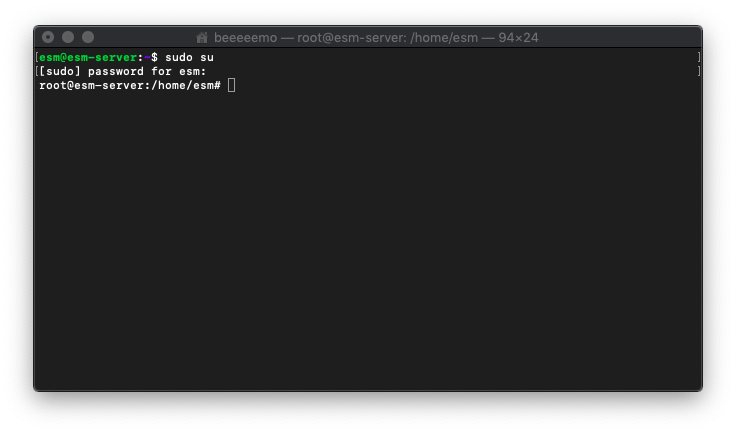

# SecBuzzerESM 安裝手冊

# 需求配置

- OS: Ubuntu 18.04 UP
- MEM: 8G UP
- HDD: 2T UP

# 系統安裝說明

---

安裝過程需使用 `root` 權限

```bash
sudo su
```



## 下載專案

```bash
git clone https://github.com/cyber00rn/SecBuzzerESM.git
```


## 移動到 opt 目錄下


```bash
cd SecBuzzerESM
mv SecBuzzerESM /opt/
```

## 查閱網卡名稱

```bash
ifconfig
```

網卡名稱如下圖紅框


## 設定 SecBuzzerESM.env

```bash
cd /opt/SecBuzzerESM
nano SecBuzzerESM.env
```

```bash
# === Elasticsearch === 
ES_VOLUME_PATH=/opt/Logs/ES/volume
ES_MEM=1024m
ES1_MEM=1024m
ES2_MEM=1024m
# === Fluentd ===
FLUENTD_BUFFER_PATH=/opt/Logs/Buffers
# === Suricata ===
SURICATA_LOG_PATH=/opt/Logs/Suricata
IF_NAME=
# === Grafana ===
GF_SMTP=false
GF_SMTP_HOST=smtp.gmail.com:465
GF_SMTP_FROM_ADDRESS=
GF_SMTP_USER=
GF_SMTP_PASSWORD=
# === WEB ===
WEB_IF_NAME=
API_KEY_VALUE=
ORG_3_CODE=
```

編輯完成後輸入 `Ctrl+X` 存檔

### Elasticsearch

- ES_VOLUME_PATH

Elasticsearch Volume 存放位置, 建議保持預設

- ES_MEM, ES1_MEM, ES2_MEM

設定 Elasticsearch 記憶體上限, 建議 4G 以上且三台節點相同, 

請注意, 若是三台節點設定 4G 請注意記憶體是否大於 12G

---

### Fluentd

- FLUENTD_BUFFER_PATH

Fluentd Buffer 存放位置

---

### Suricata

- SURICATA_LOG_PATH

Suricata 輸出 eve.json 存放位置

- IF_NAME

Suricata 監控的網卡

---

### Grafana

- GF_SMTP

SMTP 功能是否開啟, 開啟填 `true`

- GF_SMTP_HOST

SMTP Server 設定, 預設為 Google

- GF_SMTP_FROM_ADDRESS

發出 E-mail 時使用的地址

- GF_SMTP_USER

SMTP 帳號

- GF_SMTP_PASSWORD

SMTP 密碼

---

### WEB

- WEB_IF_NAME

本機 IP 的網卡

- API_KEY_VALUE

從ESM網站上取得的 API KEY

- ORG_3_CODE

從 ESM 網站上取得 ESM 界定的第三階組織代碼

---

## 安裝 SecBuzzerESM

```bash
cd /opt/SecBuzzerESM
source Offline_Install.sh
```


## 執行 SecBuzzerESM

```bash
cd /opt/SecBuzzerESM
./compose.sh up
```

