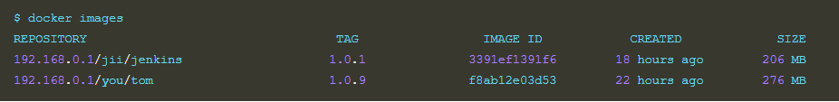

# SecBuzzerESM 重新安裝手冊

進入Ubuntu中，因安裝過程需使用 root 權限，請先進行帳號的切換

```bash
sudo su
```

# 1. 關閉現行所有的docker container
```bash
cd /etc/SecBuzzerESM
./compose.sh down
docker kill $(docker ps -q)
docker rm $(docker ps -a -q)
```

# 2. 刪除所有docker image
```bash
docker rmi $(docker images -q)
```
## 2.1 Error: image is referenced in multiple repositories

刪除映象，會報錯


檢視映象，仔細觀察，發現f8ab12e03d53這個映象id指向了兩個repository，因此無法刪除


刪除時可以用repository和tag的方式來刪除


再次檢視映象，1.0.8的就被刪除了



或是直接一點
```bash
docker image prune -a
```
一口氣強制清掉


# 3. 將docker與docker-compose清掉
```bash
rm /usr/bin/docker*
rm /usr/local/bin/docker-compose
```

## 3.1 額外參考
https://askubuntu.com/questions/935569/how-to-completely-uninstall-docker
```bash
sudo rm -rf /var/lib/docker /etc/docker
sudo rm /etc/apparmor.d/docker
sudo groupdel docker
sudo rm -rf /var/run/docker.sock
```

# 4. 備份env
```bash
cp /opt/SecBuzzerESM/SecBuzzerESM.env /home/esm/
```

# 5. 移除SecBuzzerESM
```bash
rm -r /opt/SecBuzzerESM
```

# 6. 重新安裝...
剩餘步驟可參考SecBuzzerESM 離線安裝手冊或是連線安裝手冊
內容是一樣的